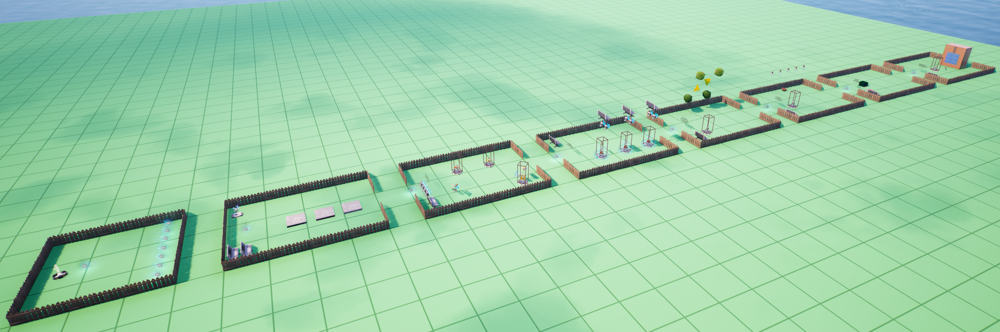

# 7 minigame concepts for UEFN/Verse lessons

Here we present concepts for the seven minigames aimed to be used in lessons on customized game mechanics in UEFN/Verse. 

We have been demonstrated an approuch to learning UEFN/Verse in a demo course [Learn to code with Verse and UEFN](https://petljamediastorage.blob.core.windows.net/temp/learn-verse/index.html), but that demo lacks more complete examles that could be used to jums-start into making games.

Minigames we present here are, for the sake of simplicity, implemted on a single plane grid island with teleports from the player spawner location. Final game examples in lessons may upgrade presented cocepts to even more compleate game experiences, but also can be devided into milestones to allow more gradual steps throught lessons. 



```{toctree}
:maxdepth: 1
:caption: Minigames
:glob:

mg1_step_and_score/step_and_score
mg2_item_exchange/item_exchange
mg3_pick_and_put/pick_and_put
mg4_moving_balls/moving_balls
mg5_drop_and_catch/drop_and_catch
mg6_push_the_box/push_the_box
mg7_hit_right_cubes/hit_right_ cubes
```